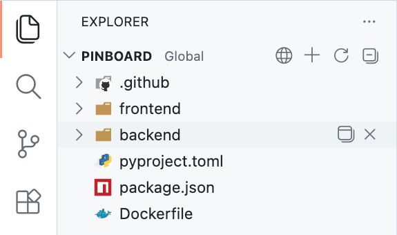

# Pinboard



A VS Code extension that adds a **Pinboard** panel inside the Explorer sidebar. Pin any file or folder on disk as a persistent shortcut - independent of your current workspace.

Install from the Visual Studio Marketplace:

https://marketplace.visualstudio.com/items?itemName=daanrosendal.pinboard

---

## Features

### Pin files and folders

Click **+** in the panel header to pick any file or folder, or right-click any item in the Explorer file tree and choose **Pin to Pinboard**.

### Browse folders inline

Pinned folders are fully expandable tree nodes. Navigate subfolders and open files directly in the editor - no new window required.

### Two persistence scopes

Toggle between **Global** (pins survive across all workspaces) and **Workspace** (pins are local to the current workspace) using the scope button in the panel header. Also configurable via `Settings > Pinboard > Scope`.

### Context menu

Right-click any item for contextual actions:

| Item type     | Actions                                                                                                                                                 |
| ------------- | ------------------------------------------------------------------------------------------------------------------------------------------------------- |
| Pinned folder | New File, New Folder, Reveal in Finder, Open in Terminal, Find in Folder, Move Up, Move Down, Open in New Window, Copy Path, Copy Relative Path, Rename, Delete, Unpin Folder |
| Pinned file   | Open to the Side, Move Up, Move Down, Copy Path, Copy Relative Path, Reveal in Finder, Rename, Delete, Unpin File                                                           |
| Subfolder     | New File, New Folder, Reveal in Finder, Open in Terminal, Find in Folder, Copy Path, Copy Relative Path, Rename, Delete                                 |
| Nested file   | Open to the Side, Reveal in Finder, Copy Path, Copy Relative Path, Rename, Delete                                                                       |

### Drag to reorder

Drag pinned items to rearrange them. Order is persisted.

### Dead path cleanup

Paths that no longer exist on disk are silently removed on startup.

---

## Usage

| Action             | How                                                                                                  |
| ------------------ | ---------------------------------------------------------------------------------------------------- |
| Pin a folder       | Click `+` in the panel header, or right-click a folder in Explorer and choose **Pin to Pinboard**   |
| Pin a file         | Click `+` in the panel header, or right-click a file in Explorer and choose **Pin to Pinboard**     |
| Unpin a folder     | Hover a pinned folder and click **Unpin Folder**, or right-click it and choose **Unpin Folder**     |
| Unpin a file       | Hover a pinned file and click **Unpin File**, or right-click it and choose **Unpin File**           |
| Open in new window | Hover a pinned folder and click **Open in New Window**, or right-click it and choose that action    |
| Toggle scope       | Click the scope button in the panel header to switch between **Global** and **Workspace**            |
| Reorder            | Drag a pinned item, or right-click it and choose **Move Up** or **Move Down** |

---

## Extension Settings

| Setting          | Default    | Description                                                                                                |
| ---------------- | ---------- | ---------------------------------------------------------------------------------------------------------- |
| `pinboard.scope` | `"global"` | `"global"` - pins persist across all workspaces. `"workspace"` - pins are scoped to the current workspace. |

---

## Development

```bash
npm install
npm run compile   # type-check + lint + bundle
npm run watch     # incremental rebuild on save
```
